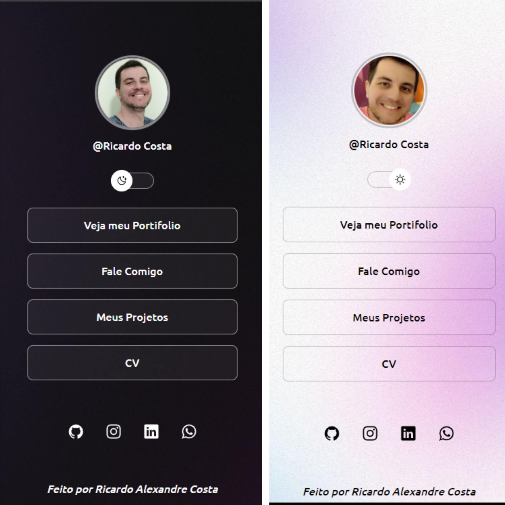

<h1 align="center"> RickLinks </h1>

Programa exclusivo e gratuito, promovido pela Rocketseat para ensino de tecnologias WEB.

  <a href="#-tecnologias">Tecnologias</a>&nbsp;&nbsp;&nbsp;|&nbsp;&nbsp;&nbsp;
  <a href="#-projeto">Projeto</a>&nbsp;&nbsp;&nbsp;|&nbsp;&nbsp;&nbsp;
  <a href="#-layout">Layout</a>&nbsp;&nbsp;&nbsp;|&nbsp;&nbsp;&nbsp;
  <a href="#memo-licença">Licença</a>

  

 

  

## 🚀 As Tecnologias

Esse projeto foi desenvolvido com as seguintes tecnologias:

- HTML e CSS
- JavaScript
- Git e Github

## 💻 O Projeto

O Projeto é como uma Pagina de Links   Também tem como finalidade de colocar os conhecimentos em HTML | CSS | JAVASCRIPT. 
O projeto conta com um button toggle que ao clica-lo o layout muda!

## 🔖 Layout

Você pode visualizar o layout do projeto através [DESSE LINK](<https://www.figma.com/file/IPOD06d2HCZOfX0YLlBQdo/DevLinks-(Community)-(Copy)?t=MG5lYTAKYOd7gYFn-0>). É necessário ter conta no [Figma](https://figma.com) para acessá-lo.

## :memo: Licença

Esse projeto está sob a licença MIT.

---

Feito com ♥ by Ricardo A Costa :wave: [Participe da nossa comunidade!](https://discord.gg/rocketseat)
